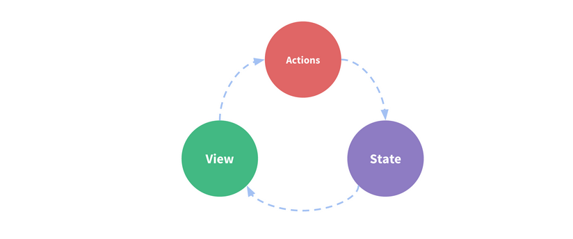
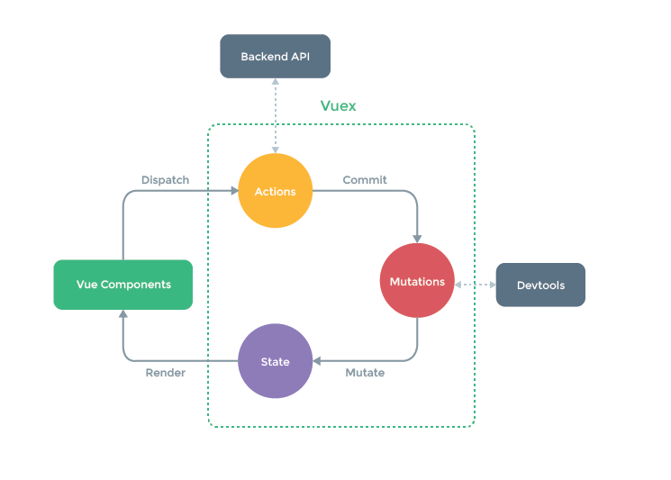

### Vuex  是什么

一个专门为 Vue.js 应用程序开发的状态管理模式。

它采用集中式存储管理应用的所有组件的状态，并以相应的规则保证状态以一种可预测的方式发生变化。


### 什么是“状态管理模式”

从一个简单的 Vue 计数应用开始：

```
new Vue({
	// state
	data () {
		return {
			count: 0
		}
	},
	// view
	template: `
		<div>{{ count }}</div>
	`,
	// actions
	methods: {
		increment () {
			this.count++
		}
	}
})

```

这个状态资管理应用包含以下几个部分：

- state，驱动应用的数据源
- vie，以声明方式将 state 映射到视图；
- actions，响应在 view 上的用户输入导致的状态变化。


----

> 一个表示“单向数据流”理念的简单示意：




> 多组件共享状态时，单向数据流的简洁性很容易被破坏：

- 多个视图依赖于同一状态
- 来自不同视图的行为需要变更同一状态

对于问题一，**传参的方法对于多层嵌套的组件**将会非常繁琐，并对于兄弟组件间的状态传递无能为力。

对于问题二，我们经常会采用**父子组件**直接引用或者通过事件来变更和同步状态的多份拷贝。

以上的这些模式非常脆弱，通常会导致无法维护的代码。


为什么我们不把组件的共享状态抽取出来，以一个全局单利模式管理呢？在这种模式下，我们的组件树构成了一个巨大的“视图”，不管树的哪个位置，任何组件都能获取状态或者触发行为！


通过定义和隔离状态管理中的各种概念，并通过强制规则维持视图和状态间的独立性，我们的代码将会变得更结构化且易维护。





Vuex 适用的情况：大型单页应用，更好地在组件外部管理状态。


> 参考资料：https://vuex.vuejs.org/zh/guide


